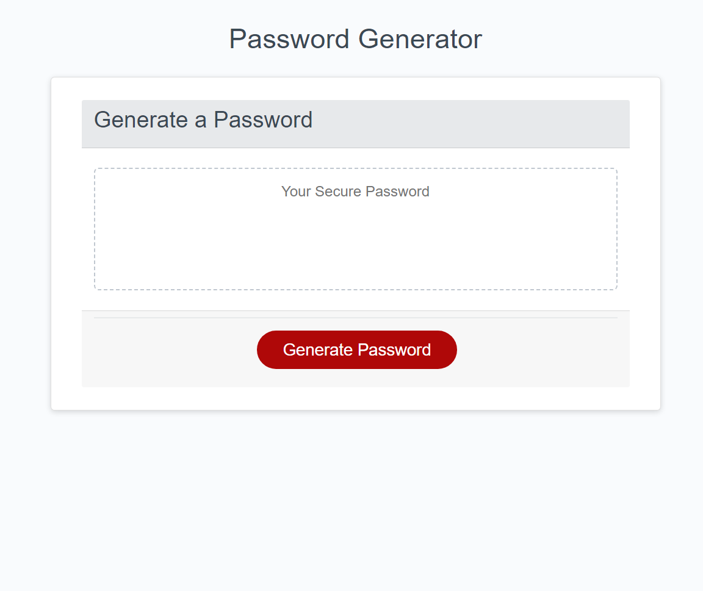

# Module 5 Challenge: Password Generator

## Application

## Demo

## Overview
 
This week’s challenge requires you to create an application that an employee can use to generate a random password based on criteria they’ve selected by modifying starter code. This app will run in the browser, and will feature dynamically updated HTML and CSS powered by JavaScript code that you write. It will have a clean and polished user interface that is responsive, ensuring that it adapts to multiple screen sizes.

The password can include special characters. If you’re unfamiliar with these, see this [list of Password Special Characters from the OWASP Foundation](https://www.owasp.org/index.php/Password_special_characters).

## Instructions

1) Click the Generate Password Button
2) Answer the prompts
